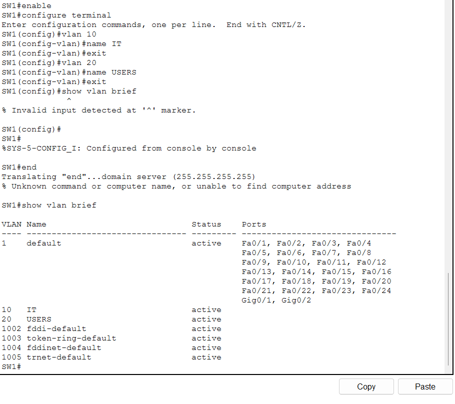
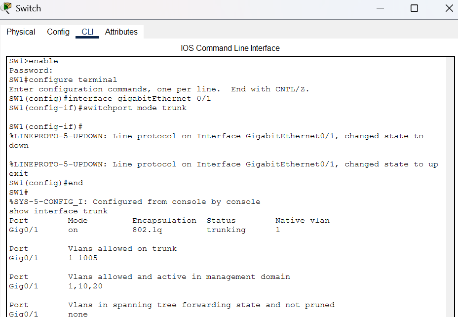
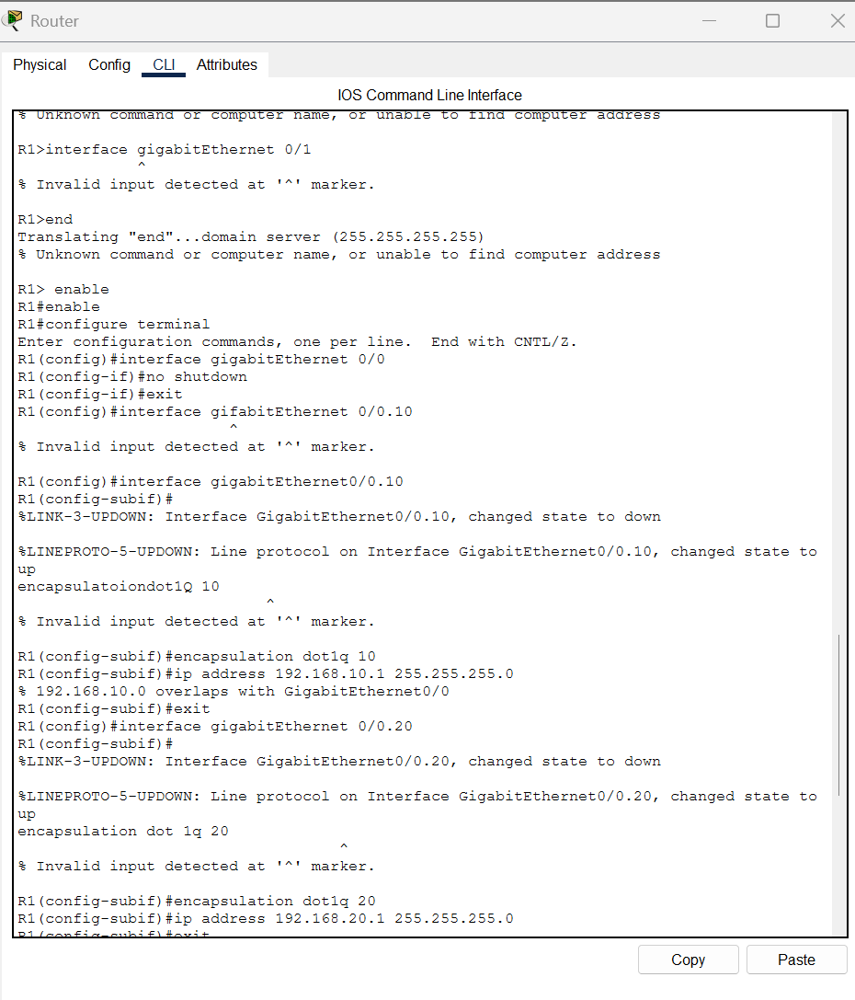
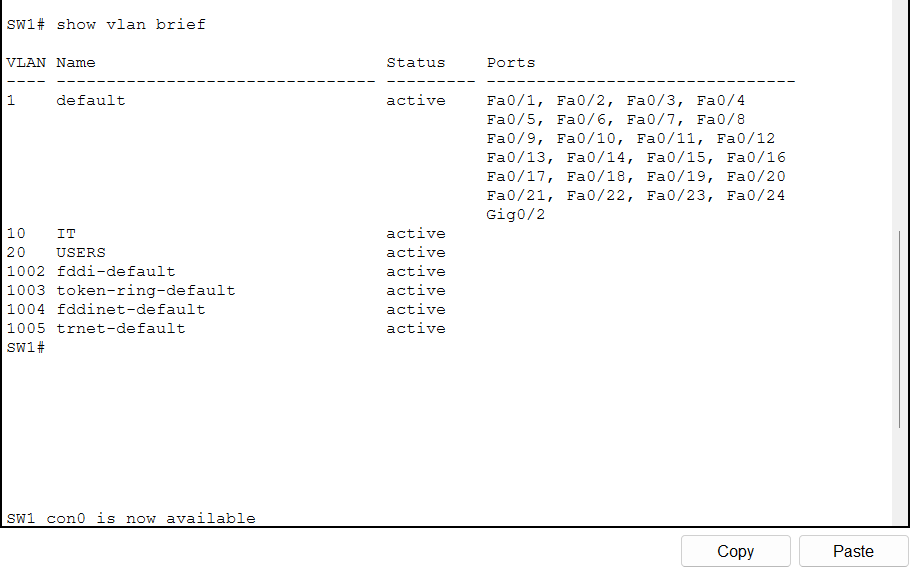
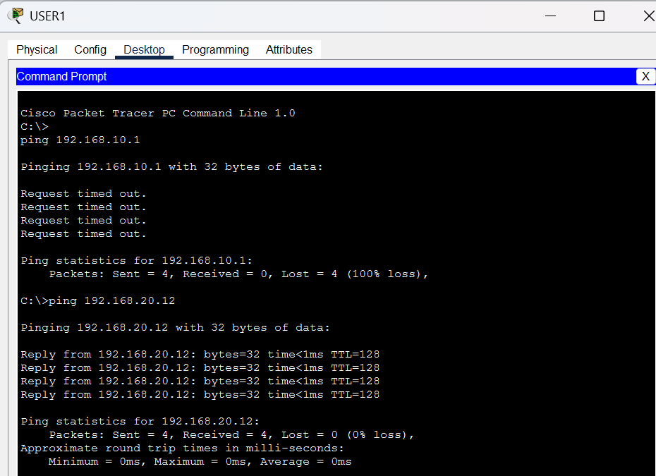
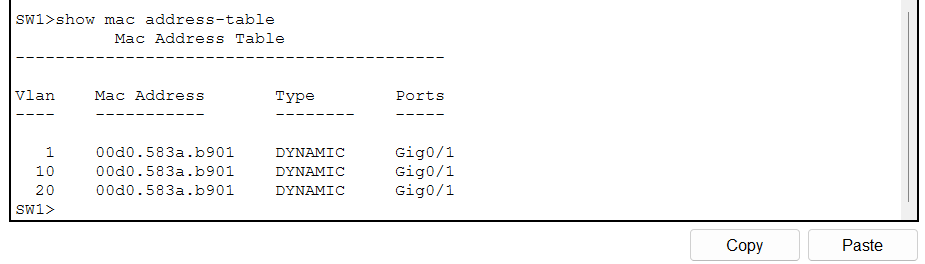

# 🟦 LAB 4 — VLANs & Inter-VLAN Routing

## 🎯 Overview

This lab demonstrates how to configure **VLANs and inter-VLAN routing** using Cisco Packet Tracer.

The network is divided into two logical VLANs, with a Cisco 2911 router configured using **router-on-a-stick** to allow communication between the VLANs.

This project demonstrates practical networking skills that are useful for **IT Support, Service Desk, Desktop Support, and Junior Network Support** roles.

---

## 🎯 Objectives

In this lab, I learned how to:

* Create VLANs on a Cisco switch
* Assign switch ports to specific VLANs
* Configure access ports
* Configure an 802.1Q trunk
* Configure router subinterfaces
* Implement router-on-a-stick
* Configure IP addresses and default gateways
* Test connectivity within VLANs
* Configure and test inter-VLAN routing
* Verify MAC address tables
* Troubleshoot VLAN connectivity

---

# 🖥️ Network Topology

The topology consists of:

* 1 × Cisco 2911 Router
* 1 × Cisco 2960 Switch
* 6 × PCs

```text
                         ROUTER
                        Cisco 2911
                           G0/0
                            │
                         TRUNK
                            │
                     ┌──────┴──────┐
                     │     SW1     │
                     │    2960     │
                     └─────────────┘
                       │ │ │ │ │ │
                       │ │ │ │ │ │
                      PC1 PC2 PC3 PC4 PC5 PC6
```

### VLAN Design

| VLAN | Name  | Network         | Devices       |
| ---- | ----- | --------------- | ------------- |
| 10   | IT    | 192.168.10.0/24 | PC1, PC2, PC3 |
| 20   | USERS | 192.168.20.0/24 | PC4, PC5, PC6 |

### Switch Port Assignment

| Device      | Switch Port | VLAN    |
| ----------- | ----------- | ------- |
| PC1         | Fa0/2       | VLAN 10 |
| PC2         | Fa0/3       | VLAN 10 |
| PC3         | Fa0/4       | VLAN 10 |
| PC4         | Fa0/5       | VLAN 20 |
| PC5         | Fa0/6       | VLAN 20 |
| PC6         | Fa0/7       | VLAN 20 |
| Router G0/0 | G0/1        | Trunk   |

---

# ⚙️ STEP 1 — Create VLANs

On **SW1**, I created two VLANs:

```bash
enable
configure terminal

vlan 10
name IT
exit

vlan 20
name USERS
exit
```

I then verified the VLAN configuration:

```bash
show vlan brief
```

### 📸 VLAN Configuration



The output confirms that **VLAN 10 (IT)** and **VLAN 20 (USERS)** were created successfully.

---

# 🔌 STEP 2 — Configure VLAN 10 Access Ports

PC1, PC2, and PC3 were assigned to VLAN 10.

```bash
interface range fastEthernet 0/2 - 4
switchport mode access
switchport access vlan 10
exit
```

```text
PC1 → Fa0/2 → VLAN 10
PC2 → Fa0/3 → VLAN 10
PC3 → Fa0/4 → VLAN 10
```

---

# 🔌 STEP 3 — Configure VLAN 20 Access Ports

PC4, PC5, and PC6 were assigned to VLAN 20.

```bash
interface range fastEthernet 0/5 - 7
switchport mode access
switchport access vlan 20
exit
```

```text
PC4 → Fa0/5 → VLAN 20
PC5 → Fa0/6 → VLAN 20
PC6 → Fa0/7 → VLAN 20
```

---

# 🔀 STEP 4 — Configure the Trunk

The connection between the switch and router was configured as an **802.1Q trunk**.

```text
Router G0/0
     │
     │
     ▼
Switch G0/1
```

On SW1:

```bash
interface gigabitEthernet 0/1
switchport mode trunk
exit
```

The trunk was then verified with:

```bash
show interfaces trunk
```

### 📸 Trunk Configuration



The output confirms that **G0/1 is operating as a trunk**.

---

# 🔀 STEP 5 — Configure Router-on-a-Stick

The Cisco 2911 router was configured with two subinterfaces.

The physical interface was enabled first:

```bash
enable
configure terminal

interface gigabitEthernet 0/0
no shutdown
exit
```

## VLAN 10 Subinterface

```bash
interface gigabitEthernet 0/0.10
encapsulation dot1Q 10
ip address 192.168.10.1 255.255.255.0
exit
```

## VLAN 20 Subinterface

```bash
interface gigabitEthernet 0/0.20
encapsulation dot1Q 20
ip address 192.168.20.1 255.255.255.0
exit
```

The configuration was saved:

```bash
end
write memory
```

### 📸 Router Subinterfaces



The router now provides the default gateway for each VLAN:

```text
VLAN 10 → 192.168.10.1
VLAN 20 → 192.168.20.1
```

---

# 🌐 STEP 6 — Configure PC IP Addresses

Static IP addresses were configured on each PC.

| Device | IP Address    | Subnet Mask   | Default Gateway |
| ------ | ------------- | ------------- | --------------- |
| PC1    | 192.168.10.11 | 255.255.255.0 | 192.168.10.1    |
| PC2    | 192.168.10.12 | 255.255.255.0 | 192.168.10.1    |
| PC3    | 192.168.10.13 | 255.255.255.0 | 192.168.10.1    |
| PC4    | 192.168.20.11 | 255.255.255.0 | 192.168.20.1    |
| PC5    | 192.168.20.12 | 255.255.255.0 | 192.168.20.1    |
| PC6    | 192.168.20.13 | 255.255.255.0 | 192.168.20.1    |

---

# 🧪 STEP 7 — Test VLAN 10 Connectivity

From **PC1**, I tested connectivity to PC2:

```bash
ping 192.168.10.12
```

Then PC3:

```bash
ping 192.168.10.13
```

Because PC1, PC2, and PC3 belong to the same VLAN and subnet, they should communicate successfully.

### 📸 VLAN 10 Connectivity



---

# 🧪 STEP 8 — Test VLAN 20 Connectivity

From **PC4**, I tested connectivity to PC5:

```bash
ping 192.168.20.12
```

Then PC6:

```bash
ping 192.168.20.13
```

These devices should also communicate successfully because they belong to the same VLAN and subnet.

---

# ⭐ STEP 9 — Test Inter-VLAN Routing

This is the main objective of the lab.

From **PC1 (VLAN 10)**, I tested connectivity to **PC4 (VLAN 20)**:

```bash
ping 192.168.20.11
```

### 📸 Inter-VLAN Ping



A successful response demonstrates that traffic can travel between VLAN 10 and VLAN 20 through the router.

### Traffic Flow

```text
PC1
192.168.10.11
     │
     ▼
 VLAN 10
     │
     ▼
   SW1
     │
     ▼
  TRUNK
     │
     ▼
 ROUTER
     │
     ├── G0/0.10
     │   192.168.10.1
     │
     └── G0/0.20
         192.168.20.1
             │
             ▼
          VLAN 20
             │
             ▼
            PC4
       192.168.20.11
```

The router performs the Layer 3 routing between the two networks.

---

# 🔍 STEP 10 — Verify the Switch Configuration

## Display VLANs

```bash
show vlan brief
```

This verifies the VLANs and port assignments.

## Display Trunk

```bash
show interfaces trunk
```

This verifies that the router connection is operating as a trunk.

## Display MAC Address Table

```bash
show mac address-table
```

### 📸 MAC Address Table



The MAC address table shows the switch learning MAC addresses from connected devices.

---

# 🔍 STEP 11 — Verify Router Interfaces

On the router:

```bash
show ip interface brief
```

Expected configuration:

```text
GigabitEthernet0/0.10    192.168.10.1
GigabitEthernet0/0.20    192.168.20.1
```

Both subinterfaces should be operational.

---

# 🛠️ Troubleshooting

If inter-VLAN routing does not work, the following checks can be performed.

### Check VLANs

```bash
show vlan brief
```

Confirm:

```text
Fa0/2 - Fa0/4 → VLAN 10
Fa0/5 - Fa0/7 → VLAN 20
```

### Check the Trunk

```bash
show interfaces trunk
```

Confirm that:

```text
G0/1 → Trunk
```

### Check Router Interfaces

```bash
show ip interface brief
```

Confirm:

```text
G0/0.10 → 192.168.10.1
G0/0.20 → 192.168.20.1
```

### Check Default Gateways

VLAN 10:

```text
192.168.10.1
```

VLAN 20:

```text
192.168.20.1
```

### Check PC IP Addresses

```text
VLAN 10 → 192.168.10.0/24
VLAN 20 → 192.168.20.0/24
```

---

# 📸 Project Screenshots

The main evidence collected during the lab is stored in the `screenshots/` directory.

| Screenshot                    | Description                         |
| ----------------------------- | ----------------------------------- |
| `01-vlan-configuration.png`   | VLAN 10 and VLAN 20 configuration   |
| `02-trunk-configuration.png`  | Switch trunk configuration          |
| `03-router-subinterfaces.png` | Router-on-a-stick configuration     |
| `04-vlan-connectivity.png`    | Same-VLAN connectivity test         |
| `05-inter-vlan-ping.png`      | Successful inter-VLAN communication |
| `06-mac-address-table.png`    | Switch MAC address table            |

---

# 📁 Repository Structure

```text
Cisco-Packet-Tracer-Lab-4-VLAN/
│
├── Lab-4-VLAN-Inter-VLAN-Routing.pkt
├── README.md
│
└── screenshots/
    ├── 01-vlan-configuration.png
    ├── 02-trunk-configuration.png
    ├── 03-router-subinterfaces.png
    ├── 04-vlan-connectivity.png
    ├── 05-inter-vlan-ping.png
    └── 06-mac-address-table.png
```

---

# 🧠 Key Networking Concepts

### VLAN

A **Virtual LAN (VLAN)** logically separates devices into different broadcast domains.

### Access Port

An access port normally carries traffic for a single VLAN and is commonly used to connect end devices.

### Trunk Port

A trunk carries traffic for multiple VLANs between network devices.

### 802.1Q

802.1Q is the VLAN tagging method used to identify VLAN traffic across trunk links.

### Router-on-a-Stick

Router-on-a-stick uses multiple router subinterfaces over one physical interface to provide routing between VLANs.

### Inter-VLAN Routing

Inter-VLAN routing allows devices in different VLANs and different IP networks to communicate through a Layer 3 device.

---

# 💼 IT Support Portfolio Skills

This project demonstrates practical experience with:

* Cisco Packet Tracer
* Cisco IOS CLI
* VLAN configuration
* Network segmentation
* Access ports
* Trunk ports
* 802.1Q
* Router-on-a-stick
* Router subinterfaces
* IPv4 addressing
* Default gateways
* Inter-VLAN routing
* Ping testing
* MAC address tables
* Network troubleshooting

These are useful foundational skills for **IT Support, Service Desk, Desktop Support, Network Support, and Junior Network Administrator** roles.

---

# 🚀 Possible Future Improvements

The lab can be expanded by adding:

* DHCP for each VLAN
* A management VLAN
* A third VLAN
* A second switch
* Switch-to-switch trunking
* SSH remote management
* Port security
* DHCP troubleshooting
* Additional routers
* Network failure scenarios

---

# ✅ Final Result

The completed lab successfully demonstrates **VLAN segmentation and inter-VLAN routing** using a Cisco 2960 switch and Cisco 2911 router.

```text
                 Cisco 2911
                     │
              802.1Q TRUNK
                     │
                Cisco 2960
                /        \
           VLAN 10       VLAN 20
          192.168.10.0  192.168.20.0
          /    |    \    /    |    \
        PC1   PC2   PC3 PC4   PC5   PC6
```

The final network allows devices to communicate:

```text
Same VLAN
   ✅

Different VLANs
   ✅

Inter-VLAN Routing
   ✅
```

**Lab 4 completed — VLANs & Inter-VLAN Routing successfully configured and tested.** 🚀
